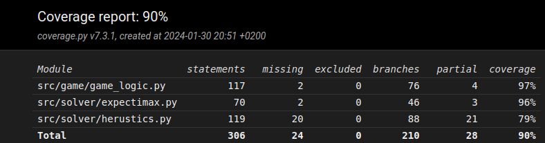

## Unit testaus

Tällähetkellä ei oikein ole muuta testausta kun pytestillä toteustettu testaus.

Testikattavuus on hyvällä tasolla. Testausta ei ole toteutettu tekoälyllä.

## Suorituskyky testaus 
20 peliä
korkein arvo / pisteet
1. 2048 / 3100
2. 2048 / 3110
3. 1024 / 2120
4. 1024 / 2096
5. 2048 / 3164
6. 2048 / 3428
7. 2048 / 3160
8. 1024 / 2020
9. 1024 / 1828
10. 1024 / 2004
11. 1024 / 2074
12. 1024 / 2112
13. 2048 / 2776
14. 1024 / 1642
15. 1024 / 1578
16. 1024 / 2074
17. 1024 / 2252
18. 1024 / 2160
19. 2048 / 3974
20. 1024 / 2104

7 / 20 2048
keskiarvo pisteet: 2438,8
